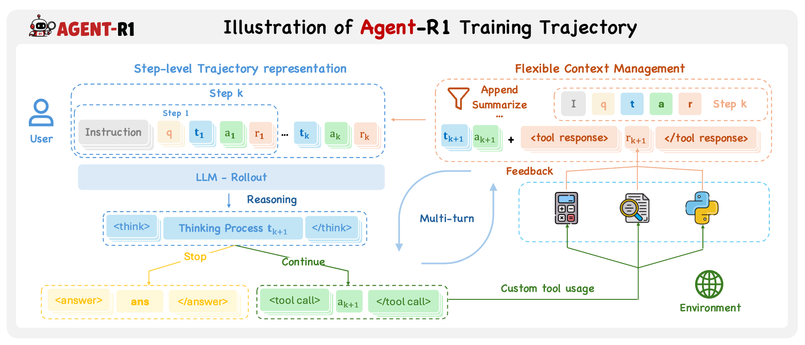
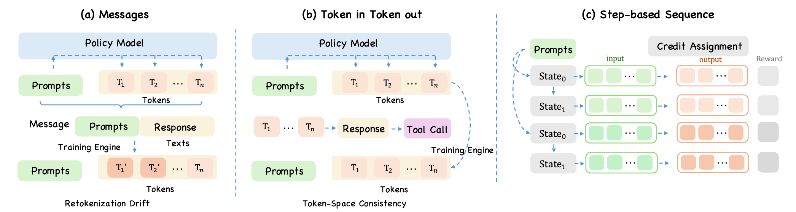

<h1 align="center">Agent-R1: Training Powerful LLM Agents with<br>End-to-End Reinforcement Learning</h1>

<p align="center">
  <a href="https://arxiv.org/abs/2511.14460"></a>
  <a href="https://agentr1.github.io/agent-r1/docs/"></a>
  <a href="https://deepwiki.com/AgentR1/Agent-R1"></a>
  <a href="https://github.com/AgentR1/Agent-R1/stargazers"></a>
  <a href="https://github.com/AgentR1/Agent-R1/network/members"></a>
</p>

<p align="center"></p>

**Agent-R1** is a unified, modular framework for **Agentic Reinforcement Learning**. It trains multi-step LLM agents through a step-native RL loop, where the model observes an environment, generates an action, receives tool or environment feedback, and continues until the task is solved or terminated.

Unlike single-turn RL pipelines that treat interaction as one growing prompt-response sequence, Agent-R1 models every turn as a **step-level MDP transition**. This makes tool use, environment state, context management, reward assignment, and policy optimization explicit parts of the same training substrate.

## News

- [2026.03.23] **Agent-R1 v0.1.0 is the first official release of the refactored architecture.** It introduces the **Step-level MDP** foundation and new **Layered Abstractions**. The previous implementation is archived on the `legacy` branch.
- [2026.03.04] **[Claw-R1](https://agentr1.github.io/Claw-R1/) is released.** It extends Agentic RL to general agents such as OpenClaw through a middleware-style design. See [AgentR1/Claw-R1](https://github.com/AgentR1/Claw-R1).

<details>
<summary><b>Earlier Updates</b></summary>

- [2026.01.10] **PaperScout** is released: an autonomous academic paper search agent trained with Agent-R1 and Proximal Sequence Policy Optimization. Read the paper [here](https://arxiv.org/abs/2601.10029).
- [2025.11.18] The Agent-R1 technical report is released on [arXiv](https://arxiv.org/abs/2511.14460).
- [2025.05.06] Tool environments are redesigned to support more flexible agent-tool interaction patterns.
- [2025.05.06] GRPO and REINFORCE++ training crashes caused by NaN values are fixed. See [issue #30](https://github.com/0russwest0/Agent-R1/issues/30).
- [2025.04.01] Basic inference scripts and an interactive chat interface are added.
- [2025.03.18] Multi-modal support is added for vision-language model agents.
- [2025.03.18] `verl` is moved to a git submodule and Agent-R1 extensions are separated from upstream code.
- [2025.03.16] Process rewards are supported for per-tool-call feedback.

</details>

## Why Agent-R1

Modern LLM infrastructure already has strong serving systems such as vLLM and SGLang, and strong distributed training systems such as DeepSpeed, FSDP, and Megatron-LM. Agentic RL needs to reconnect these two sides into a **rollout -> reward -> replay -> update** loop where the model interacts with tools and environments over multiple turns.

Agent-R1 is built around three design goals:

- **Step-level trajectory representation**: each transition stores observation, action, environment feedback, reward, termination state, and next observation while preserving action boundaries and avoiding fragile `Token -> Text -> Token` reconstruction.
- **Flexible context management**: the environment decides what the model sees next, so history can be appended, truncated, summarized, rewritten, or augmented.
- **Algorithm-system decoupling**: task workflows, environments, rollout, rewards, advantage estimators, and policy objectives can evolve independently.

<p align="center"></p>

## Core Idea: Step-level MDP

In multi-turn agent training, the model is not just continuing a token sequence. Each model output can invoke tools, change the environment state, receive external feedback, and shape the next observation. Agent-R1 therefore treats the **agent step** as the basic interaction unit: a step records what the model saw, what action it produced, what feedback and reward the environment returned, and what observation should be exposed next. This step-level trajectory representation keeps rollout, replay, context construction, and credit assignment aligned with real agent decisions, while still allowing token-level policy losses inside each generated action.

<p align="center"></p>

## Architecture

Agent-R1 uses layered abstractions so new tasks can reuse the same trainer without rewriting the full RL stack.

| Layer | Responsibility | When to Use |
|---|---|---|
| `AgentFlowBase` | Full control over prompt construction, model calls, and step assembly. | Custom workflows or experimental agent logic. |
| `AgentEnvLoop` | The main multi-step loop connecting model generation with environment `reset()` / `step()`. | Most agentic RL tasks. |
| `AgentEnv` | Task environment interface returning observations, rewards, termination, and metadata. | When your task has state transitions. |
| `ToolEnv` | Built-in environment for parsing tool calls, executing tools, and feeding observations back. | Tool-augmented tasks such as GSM8K-tool. |
| `BaseTool` | Standard interface for registering executable tools. | Adding calculators, search tools, APIs, or task-specific checkers. |

The main loop is:

1. Load a sample containing `prompt`, `agent_name`, `reward_model`, and optional `env_kwargs`.
2. Create the configured `AgentFlow` and environment.
3. Generate an action from the current observation.
4. Parse the action, execute tools or update the environment, and return feedback.
5. Record the step and continue until `done=True` or `max_steps` is reached.
6. Convert the structured trace into rewards, advantages, masks, and policy updates.

## Getting Started

Agent-R1 uses the same environment setup as [verl](https://verl.readthedocs.io/en/latest/start/install.html), and the current version requires `verl==0.7.0`. You only need to clone this repository; there is no separate Agent-R1 installation step.

The recommended path is:

1. Read the [Getting Started](https://agentr1.github.io/Agent-R1/getting-started/) page for the minimal setup flow.
2. Use [`examples/data_preprocess/gsm8k.py`](examples/data_preprocess/gsm8k.py) and [`examples/run_qwen2.5-3b.sh`](examples/run_qwen2.5-3b.sh) as a sanity check that the environment is wired correctly.
3. Move to the [Agent Task Tutorial](https://agentr1.github.io/Agent-R1/tutorials/agent-task/) for the main Agent-R1 workflow based on multi-step interaction and tool use.

### Stage 1: Sanity Check the Base Training Stack

Prepare a minimal GSM8K dataset and run the single-step script:

```bash
python3 examples/data_preprocess/gsm8k.py --local_save_dir ~/data/gsm8k
bash examples/run_qwen2.5-3b.sh
```

This stage is only a **setup check**. It helps confirm that your environment, model path, dataset path, and training stack are wired correctly.

### Stage 2: Run the Main Agent-R1 Workflow

Prepare the tool-augmented dataset and launch the multi-step agent training script:

```bash
python3 examples/data_preprocess/gsm8k_tool.py --local_save_dir ~/data/gsm8k_tool
bash examples/run_qwen3-4b_gsm8k_tool.sh
```

This is the main Agent-R1 path, where `AgentEnvLoop` drives multi-step rollout and `ToolEnv` handles tool calls and environment feedback.

Core concepts:

- [Step-level MDP](https://agentr1.github.io/Agent-R1/core-concepts/step-level-mdp/)
- [Layered Abstractions](https://agentr1.github.io/Agent-R1/core-concepts/layered-abstractions/)

## Experimental Snapshot

The Agent-R1 report evaluates Qwen3-4B across representative agent scenarios. The table below summarizes the main results; see [Experiments](docs/experiments.md) for the experimental setting, task coverage, optimizer comparison, and context-management analysis.

| Method | GSM8K Acc. (%) | HotpotQA Acc. (%) | ALFWorld SR Seen (%) | ALFWorld SR Unseen (%) | WebShop Score (%) | WebShop SR (%) |
|---|---:|---:|---:|---:|---:|---:|
| ReAct | 53.1 | 25.8 | 7.14 | 2.98 | 51.58 | 23.8 |
| GRPO | **83.3** | **59.4** | **81.29** | **74.58** | 65.83 | 44.2 |
| PPO | 78.1 | 56.7 | 76.42 | 72.38 | **70.18** | **46.0** |
| REINFORCE++ | 78.9 | 52.8 | 73.84 | 69.57 | 63.41 | 41.8 |
| RLOO | 81.6 | 55.2 | 79.08 | 73.46 | 68.02 | 45.1 |

## Building a New Agent Task

For a new task, keep the trainer intact and implement the task-specific layers:

```text
recipe/<task>/
  base.yaml
  prepare_<task>_agent_r1.py
  <task>_agent_flow.py
  reward_fn.py
  prompts.py
  utils.py
  env/                       # optional environment service or wrappers
```

Typical migration checklist:

- **Data**: emit parquet rows with `prompt`, `reward_model`, `agent_name`, and `env_kwargs`.
- **Environment / tools**: define how state updates, tool observations, rewards, and termination work.
- **Agent flow**: connect model actions to the environment loop and expose step records.
- **Training script**: set paths, rollout steps, batch sizes, estimator, and policy loss through Hydra overrides.

## Documentation

- Project homepage: [https://agentr1.github.io/agent-r1](https://agentr1.github.io/agent-r1)
- Documentation: [https://agentr1.github.io/agent-r1/docs/](https://agentr1.github.io/agent-r1/docs/)

## Version Guide

- `main` contains the current v0.1.0 architecture based on Step-level MDP and layered abstractions.
- `legacy` preserves the previous implementation for reference.
- Use a recent source checkout of `verl` that includes the AgentFlow / async rollout stack required by this repository.

## Awesome Projects Using Agent-R1

- **[TableMind](https://arxiv.org/abs/2509.06278)**: an autonomous programmatic agent for tool-augmented table reasoning.
- **[PaperScout](https://arxiv.org/abs/2601.10029)**: an autonomous academic paper search agent trained with Agent-R1 and Proximal Sequence Policy Optimization.
- **[Cast-R1](https://arxiv.org/abs/2602.13802)**: an agentic framework that reformulates time-series forecasting as sequential decision making.
- **[StepPO](https://arxiv.org/abs/2604.18401)**: Step-Aligned Policy Optimization for Agentic Reinforcement Learning, a step-level Agentic RL method that treats the agent step as the action unit and aligns credit assignment with multi-turn agent decisions.

## Acknowledgements

This work is conducted at the **State Key Laboratory of Cognitive Intelligence, USTC**. We gratefully acknowledge the ideas and infrastructure from [DeepSeek-R1](https://github.com/deepseek-ai/DeepSeek-R1), [veRL](https://github.com/volcengine/verl), and [RAGEN](https://github.com/ZihanWang314/ragen). We also thank [Prof. Qi Liu](http://staff.ustc.edu.cn/~qiliuql/) and [Prof. Mingyue Cheng](https://mingyue-cheng.github.io/) for their guidance and support.

## Citation

If you find Agent-R1 useful in your research, please cite:

```bibtex
@misc{cheng2025agentr1trainingpowerfulllm,
  title={Agent-R1: Training Powerful LLM Agents with End-to-End Reinforcement Learning},
  author={Mingyue Cheng and Jie Ouyang and Shuo Yu and Ruiran Yan and Yucong Luo and Zirui Liu and Daoyu Wang and Qi Liu and Enhong Chen},
  year={2025},
  eprint={2511.14460},
  archivePrefix={arXiv},
  primaryClass={cs.CL},
  url={https://arxiv.org/abs/2511.14460}
}
```

## Star History

[](https://www.star-history.com/#AgentR1/Agent-R1&Date)
