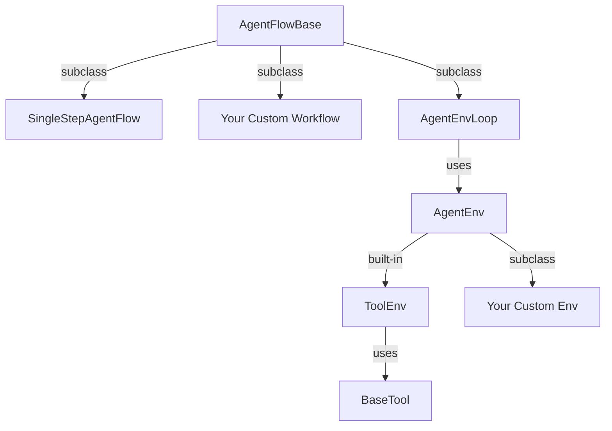

# Layered Abstractions

## From Maximum Flexibility to Out-of-the-Box

Agent-R1 provides a **three-layer abstraction** system. The top layer gives maximum control, the middle layer captures agent-environment interaction, and the bottom layer covers standard tool-calling tasks. All layers still fit the same step-level RL view.



## Layer 1: `AgentFlowBase`

Subclass `AgentFlowBase` when you want full control over how prompts are built, how the LLM is called, how branches are scheduled, how context is managed, and how steps are assembled into an `AgentFlowOutput`.

This is the most flexible layer. It is useful for complex custom agents with conditional branches, specialized context-management policies, multi-stage workflows, or experiments where you do not want to model the task explicitly as an environment.

```python
from agent_r1.agent_flow import AgentFlowBase, AgentFlowOutput

class MyWorkflow(AgentFlowBase):
    async def run(self, sampling_params, **kwargs):
        ...
        return AgentFlowOutput(steps=[step1, step2], metrics=metrics)
```

## Layer 2: `AgentEnvLoop + AgentEnv`

When your task can be written as an environment with `reset()` and `step()`, use `AgentEnvLoop`. The loop handles the LLM generation, while the environment controls the next observation and reward.

This aligns directly with the step-level MDP idea:

- the environment returns an `Observation`
- the LLM produces an `Action`
- the environment computes the next observation, reward, and termination condition

```python
from agent_r1.env import AgentEnv, Observation, Action

@AgentEnv.register("my_env")
class MyEnv(AgentEnv):
    def reset(self, **kwargs) -> Observation:
        return Observation(messages=[...])

    async def step(self, action: Action) -> tuple[Observation, float, bool, dict]:
        ...
        return Observation(messages=[...]), reward, done, info
```

The relevant implementation lives in:

- `agent_r1/agent_flow/agent_env_loop.py`
- `agent_r1/env/base.py`

## Layer 3: `ToolEnv + BaseTool`

Standard multi-turn tool-calling tasks should use `ToolEnv + BaseTool`. For this case, Agent-R1 provides `ToolEnv`, a built-in environment that:

- stores conversation history
- parses tool calls from model output
- executes registered tools
- feeds tool observations back into the next turn

Tools are defined independently through `BaseTool`.

```python
from agent_r1.tool import BaseTool, ToolResponse

@BaseTool.register("calculator")
class Calculator(BaseTool):
    name = "calculator"
    description = "Evaluate a math expression."
    parameters = {
        "type": "object",
        "properties": {
            "expression": {"type": "string", "description": "The math expression"}
        },
        "required": ["expression"],
    }

    async def execute(self, args, **kwargs) -> tuple[ToolResponse, float | None, dict]:
        ...
```

The relevant implementation lives in:

- `agent_r1/env/envs/tool.py`
- `agent_r1/tool/base.py`
- `recipes/gsm8k/tool.py`

## What Matters in This Version

For the current lightweight documentation, the key takeaway is:

- `SingleStepAgentFlow` is useful for single-turn sanity checks such as plain GSM8K.
- `AgentFlowBase` is for fully custom agent logic.
- `AgentEnvLoop` is for tasks with complete environment dynamics.
- `ToolEnv + BaseTool` is the simplest path for standard tool-calling examples such as GSM8K + Tool.
