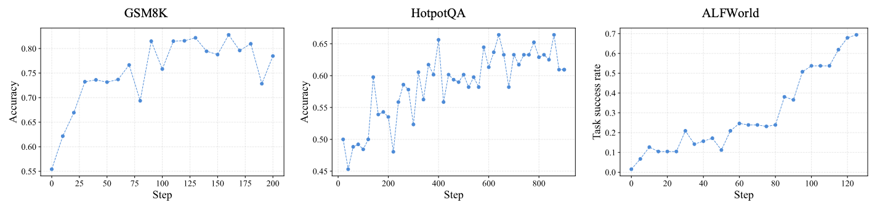
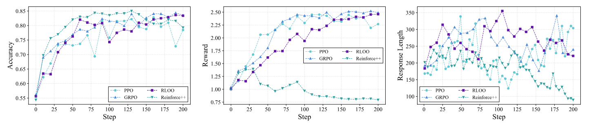
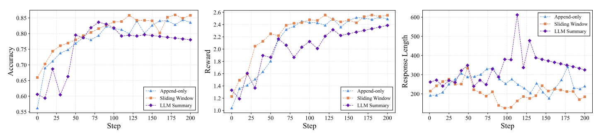

# Experiments

This page summarizes the experimental analysis for Agent-R1. The experiments ask two questions:

1. Whether the same Agent-R1 framework transfers across different agent tasks.
2. Whether the context-management interface affects learning quality under a fixed training setup.

## Experimental Setting

We instantiate Agent-R1 with Qwen3-4B on GSM8K, HotpotQA, ALFWorld, and WebShop. These tasks cover arithmetic reasoning with tool interaction, retrieval-based multi-hop question answering, embodied household interaction, and simulated online shopping.

For controlled comparisons, GSM8K is used as the main isolation setting. The environment, tool-based interaction format, rollout configuration, and reward definition are fixed, so differences can be attributed more directly to the optimizer or the context-management rule. The reward combines answer accuracy with a format component.

## Main Results Across Scenarios

The table below reports one representative metric for each task. Agent-R1 supports multiple RL methods under the same multi-turn interaction framework.

| Method | GSM8K Acc. (%) | HotpotQA Acc. (%) | ALFWorld SR Seen (%) | ALFWorld SR Unseen (%) | WebShop Score (%) | WebShop SR (%) |
|---|---:|---:|---:|---:|---:|---:|
| ReAct | 53.1 | 25.8 | 7.14 | 2.98 | 51.58 | 23.8 |
| GRPO | **83.3** | **59.4** | **81.29** | **74.58** | 65.83 | 44.2 |
| PPO | 78.1 | 56.7 | 76.42 | 72.38 | **70.18** | **46.0** |
| REINFORCE | 78.9 | 52.8 | 73.84 | 69.57 | 63.41 | 41.8 |
| RLOO | 81.6 | 55.2 | 79.08 | 73.46 | 68.02 | 45.1 |

All four RL methods outperform the training-free ReAct baseline across these settings. The best optimizer varies by task: GRPO leads on arithmetic reasoning, retrieval QA, and embodied interaction, while PPO is strongest on WebShop. This suggests that Agent-R1 is broad enough to support heterogeneous agent environments while preserving meaningful algorithm-specific behavior.

## Learning Across Tasks

Representative training curves on GSM8K, HotpotQA, and ALFWorld show clear upward trends under the same framework. The learning dynamics differ across tasks: GSM8K improves quickly and stabilizes early, HotpotQA shows slower and more fluctuating gains, and ALFWorld improves in a more stage-wise pattern with late jumps.

This is useful for interpreting Agent-R1 as a framework rather than a single benchmark recipe. The same rollout and training abstraction can transfer across tasks, but each environment still exposes its own optimization dynamics.

## Optimizer Comparison on GSM8K

We compare PPO, GRPO, REINFORCE, and RLOO under the same GSM8K environment, prompts, tool format, rollout configuration, and reward definition. The curves report reward, accuracy, and response length.

Two patterns are notable. First, GRPO and RLOO reach the strongest late-stage accuracy, while PPO is more volatile. Second, REINFORCE behaves differently: it can reach relatively high accuracy while receiving a lower reward, which is consistent with shorter later-stage responses. Since the reward includes both answer accuracy and a format component, this indicates that high task accuracy does not necessarily mean the policy maximizes the full training signal.

The takeaway is that Agent-R1 does not wash out optimizer-specific behavior. It makes that behavior observable under a common interaction setup.

## Context-Management Strategies

To test whether flexible context construction matters in practice, we compare three GSM8K context strategies under the same GRPO setup:

- **Append-only context**: keeps growing the interaction history.
- **Sliding-window context**: keeps the original question plus the most recent tool output and model analysis.
- **LLM-summarized context**: compresses the evolving interaction history with an LLM summary.

Sliding-window context performs best, append-only context is weaker, and LLM-summarized context underperforms in this small-model setting. This supports the main Agent-R1 design claim: context management is not just a presentation detail. Once the framework exposes context construction explicitly, different memory rules can be studied under the same rollout and optimizer.

The summary result should not be read as a general rejection of summary-based memory. It shows that the quality of the transformation itself becomes part of the training problem. In this setting, preserving the most relevant recent evidence gives a cleaner learning signal than either unbounded history growth or noisy compression.

