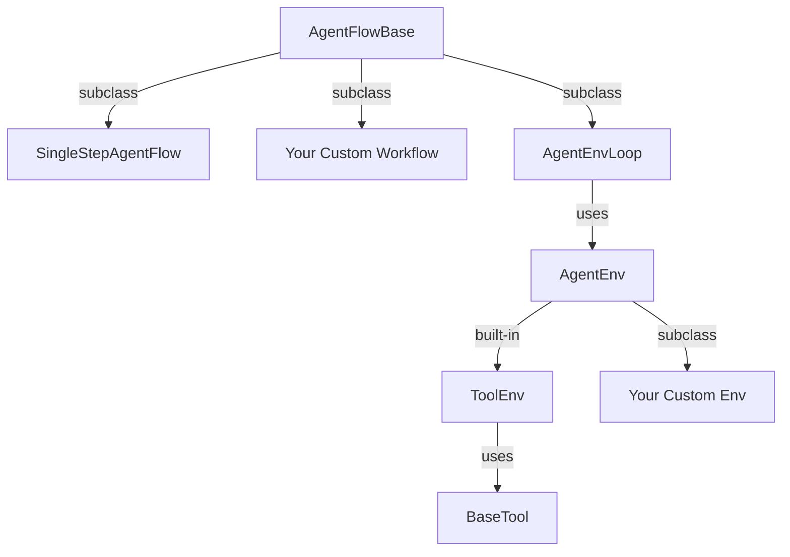

# 分层抽象

## 从完全灵活到开箱即用

Agent-R1 提供一套 **三层抽象**。顶层提供最大灵活度，中间层刻画 agent 与环境交互，底层覆盖标准工具调用任务。关键设计是：所有层都仍然符合 step-level RL 视角。



## Layer 1: `AgentFlowBase`

当你需要完全控制 prompt 如何构建、LLM 如何调用、条件分支如何调度、上下文如何管理、step 如何组装成 `AgentFlowOutput` 时，可以继承 `AgentFlowBase`。

这是最灵活的一层。它适合复杂自定义 agent，例如带有条件分支、特殊上下文管理策略、多阶段 workflow，或不适合显式建模成环境的实验性流程。

```python
from agent_r1.agent_flow import AgentFlowBase, AgentFlowOutput

class MyWorkflow(AgentFlowBase):
    async def run(self, sampling_params, **kwargs):
        ...
        return AgentFlowOutput(steps=[step1, step2], metrics=metrics)
```

## Layer 2: `AgentEnvLoop + AgentEnv`

当你的任务可以写成带有 `reset()` 和 `step()` 的环境时，使用 `AgentEnvLoop`。这个 loop 负责 LLM generation，而环境负责控制下一步观察和奖励。

这与 step-level MDP 直接对应：

- 环境返回 `Observation`
- LLM 产生 `Action`
- 环境计算下一步观察、奖励和终止条件

```python
from agent_r1.env import AgentEnv, Observation, Action

@AgentEnv.register("my_env")
class MyEnv(AgentEnv):
    def reset(self, **kwargs) -> Observation:
        return Observation(messages=[...])

    async def step(self, action: Action) -> tuple[Observation, float, bool, dict]:
        ...
        return Observation(messages=[...]), reward, done, info
```

相关实现位于：

- `agent_r1/agent_flow/agent_env_loop.py`
- `agent_r1/env/base.py`

## Layer 3: `ToolEnv + BaseTool`

标准多轮工具调用任务应该使用 `ToolEnv + BaseTool`。对于这类任务，Agent-R1 提供内置环境 `ToolEnv`，它会：

- 存储对话历史
- 从模型输出中解析工具调用
- 执行已注册工具
- 将工具观察反馈给下一轮

工具通过 `BaseTool` 独立定义。

```python
from agent_r1.tool import BaseTool, ToolResponse

@BaseTool.register("calculator")
class Calculator(BaseTool):
    name = "calculator"
    description = "Evaluate a math expression."
    parameters = {
        "type": "object",
        "properties": {
            "expression": {"type": "string", "description": "The math expression"}
        },
        "required": ["expression"],
    }

    async def execute(self, args, **kwargs) -> tuple[ToolResponse, float | None, dict]:
        ...
```

相关实现位于：

- `agent_r1/env/envs/tool.py`
- `agent_r1/tool/base.py`
- `recipes/gsm8k/tool.py`

## 当前版本最重要的点

对于当前轻量文档，最关键的是：

- `SingleStepAgentFlow` 适合 plain GSM8K 这类单轮 sanity check。
- `AgentFlowBase` 适合完全自定义的 agent 逻辑。
- `AgentEnvLoop` 适合有完整环境动态的任务。
- `ToolEnv + BaseTool` 是标准工具调用示例的最简单路径，例如 GSM8K + Tool。
