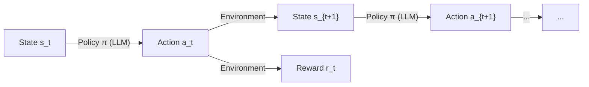

# Step-level MDP

## 面向智能体训练的原则化基础

许多已有框架把 LLM 智能体看作 token-level 过程：所谓状态是所有历史 token 的拼接，动作是下一个 token。这种视角会强制上下文单调增长，也很难在有意义的粒度上应用标准 RL 算法。

Agent-R1 采用 **step-level MDP**，把 LLM 建模为在环境中行动的智能体：

| MDP 元素 | 定义 |
|---|---|
| **状态** \(s_t\) | 第 \(t\) 步呈现给 LLM 的 prompt，完全由环境决定 |
| **动作** \(a_t\) | LLM 在第 \(t\) 步生成的完整回复 |
| **转移** \(T(s_{t+1} \mid s_t, a_t)\) | 环境根据当前状态和 LLM 回复产生下一步观察 |
| **奖励** \(r_t\) | 来自环境的逐步奖励信号 |
| **策略** \(\pi(a_t \mid s_t)\) | LLM 本身 |

这一建模带来三个关键点：

!!! success "灵活上下文"
    状态 \(s_t\) 由环境提供，而不是由所有历史 token 拼接得到。因此环境可以在步骤之间 **总结**、**截断**、**重组**，甚至 **完全替换** 上下文。只要转移函数定义清楚，MDP 仍然成立。

!!! success "有效的 RL 训练"
    每一步都有自己的观察、动作和奖励。每一步的 log-probability 都在对应的 \(s_t\) 条件下计算，因此 PPO、GRPO 等标准 policy gradient 方法可以直接应用在 step 粒度上。

!!! success "拼接只是特例"
    传统的“把所有内容追加到历史中”的做法只是某一种转移函数：\(s_{t+1} = \text{concat}(s_t,\; a_t,\; \text{env}_{output_t})\)。它是有效选择，但不是唯一选择。Agent-R1 把它作为特例支持，而不是写死成框架约束。

## 为什么它对智能体任务重要

这正是 Agent-R1 围绕 **多步智能体行为** 构建，而不是围绕单步 prompting 构建的原因。当环境拥有下一步观察的控制权时，框架可以自然支持：

- 工具调用和结构化环境反馈
- 多轮状态更新
- 逐步奖励，而不只是最终结果奖励
- 面向真实智能体任务的轨迹级训练

实践中，Agent-R1 的核心单位不是单纯的 token 流，而是一串由环境调解的交互步骤。
